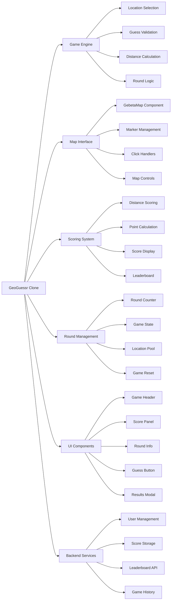
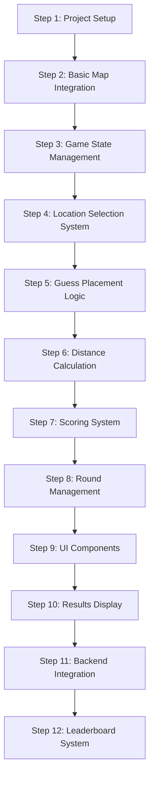
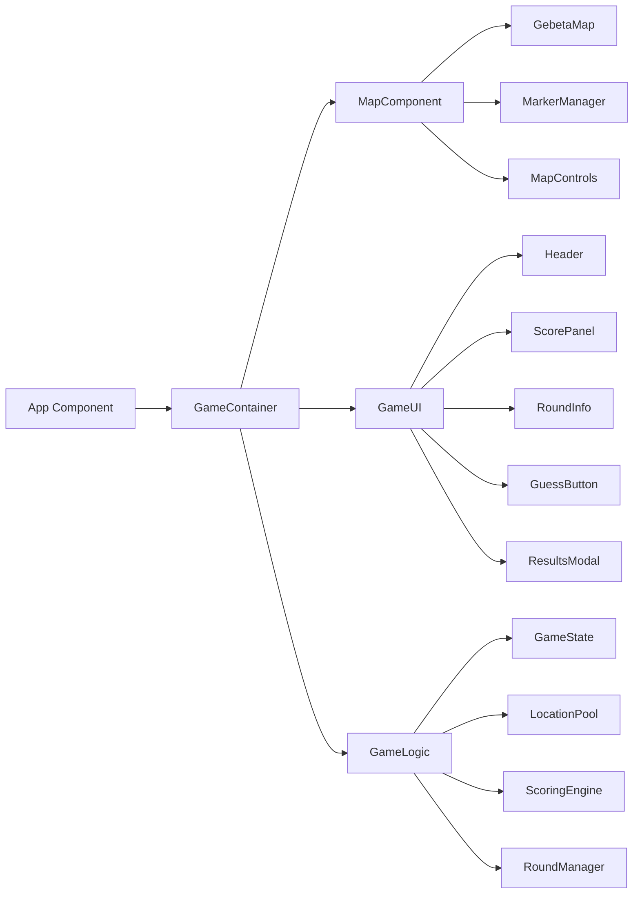
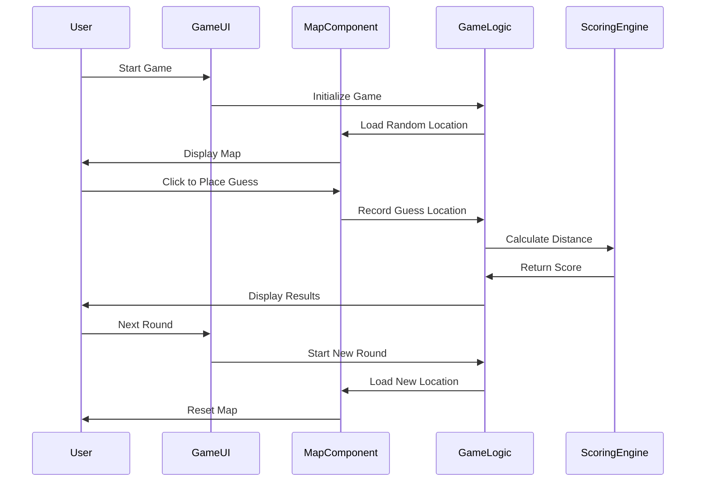
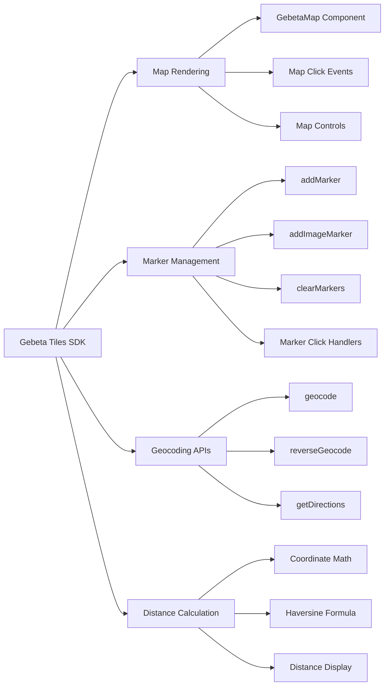

# GeoGuessr Clone Architecture

## System Overview

## Development Steps

## Component Architecture

## Data Flow

## Gebeta Tiles Integration Points

## Blog Post Structure

1. **Introduction** - What we're building and why
2. **Setup** - Project initialization with Gebeta Tiles
3. **Basic Map** - Getting the map working
4. **Game Logic** - Core game mechanics
5. **UI Components** - Building the interface
6. **Scoring** - Distance calculation and points
7. **Rounds** - Managing multiple rounds
8. **Backend Integration** - Setting up the server
9. **Leaderboard System** - User management and scoring
10. **Conclusion** - What we learned and next steps 